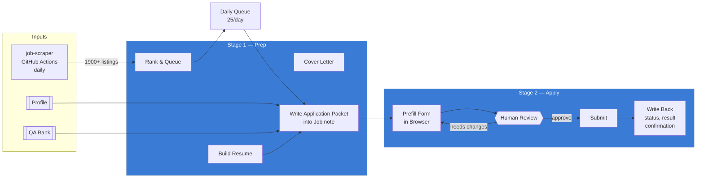

# Job Search Dashboard

> [!info] Timeline
> **Fall 2026 Internships** · **2027 New Grad** · Graduating Spring 2027

> [!tip] Start Here
> Open **[[Jobs.base#To Apply]]** to see your daily queue, or **[[Jobs.base#By Priority]]** for top-ranked targets.

---

## Database Views

> [!abstract]+ Quick Filters
> | View | Purpose |
> |------|---------|
> | **[[Jobs.base#To Apply\|To Apply]]** | Active listings you haven't acted on yet |
> | **[[Jobs.base#Applied\|Applied]]** | Submitted applications with results |
> | **[[Jobs.base#Interviewing\|Interviewing]]** | In-progress interviews |
> | **[[Jobs.base#Internships\|Internships]]** | All Fall 2026 internship listings |
> | **[[Jobs.base#New Grad\|New Grad]]** | All 2027 new grad listings |
> | **[[Jobs.base#By Priority\|By Priority]]** | Ranked to-apply queue (priority score) |
> | **[[Jobs.base#Needs Review\|Needs Review]]** | Stalled applications requiring manual action |
> | **[[Jobs.base#Auto-Applied\|Auto-Applied]]** | All pipeline-submitted applications |
> | **[[Jobs.base#All\|All]]** | Everything |

![[Jobs.base#By Priority]]

---

## How to Use

1. Open **[[Jobs.base#To Apply]]** or **[[Jobs.base#By Priority]]**
2. Click any row to open the job note
3. Set frontmatter `status:` to one of:
   > [!note] Status Values
   > `to-apply` · `applied` · `interviewing` · `offer` · `rejected` · `skip`
4. Fill in `deadline:` and `applied_date:` as `YYYY-MM-DD` so views sort correctly
5. Add free-text notes in the body below the frontmatter — they survive daily re-scrapes

> [!warning] Sync Note
> This vault is updated daily by GitHub Actions (`job-scraper` repo). Pull the latest via **`Ctrl+P` → "Obsidian Git: Pull"**. Scraped fields are refreshed each run; your `status`, `deadline`, `applied_date`, `notes`, and body text are always preserved.

---

## Auto-Apply Pipeline

> [!info] Two-Stage Process
> The pipeline reads applicant data from [[Profile/Profile]] and writes results back into job notes. It prefills everything but **never auto-submits** — you review and click submit.

| Resource | Purpose |
|----------|---------|
| [[Profile/Profile]] | Contact info, links, work authorization, EEO answers |
| [[Profile/Targeting]] | Auto-apply rules (categories, caps, resume mapping) |
| [[Profile.base]] | Q&A bank — questions and reusable answers |
| `Profile/Resumes/` | LaTeX resume source files (compiled to PDF) |

### Write-Back Fields

> [!example] Pipeline-Managed Frontmatter
> `apply_method` (`auto`\|`manual`) · `apply_result` (`success`\|`error`\|`needs-review`) · `apply_error` · `confirmation` · `resume_used` · `needs_review` (`true`\|`false`)

Generated answers are written into the note body under `## Application <date>`.

> [!danger] Cross-Repo Dependency
> All write-back fields above **must** be in the `job-scraper` preserved-fields list. If they're not, the daily scrape strips them. Check [[auto-apply/ASSESSMENT#^preserved-fields]] for current status.

---

## Pipeline Docs

- [[auto-apply/README|Auto-Apply README]] — setup, requirements, quick start
- [[auto-apply/WORKFLOW|Full Workflow Guide]] — two-stage process, gotchas, daily routine
- [[auto-apply/ASSESSMENT|Pipeline Assessment]] — current state, open issues, tuning
- [[Profile/Materials/Cover Letter Template|Cover Letter Template]]

%% Hidden: this section keeps pipeline context accessible but out of the way %%

%% Last updated: 2026-06-29 %%
